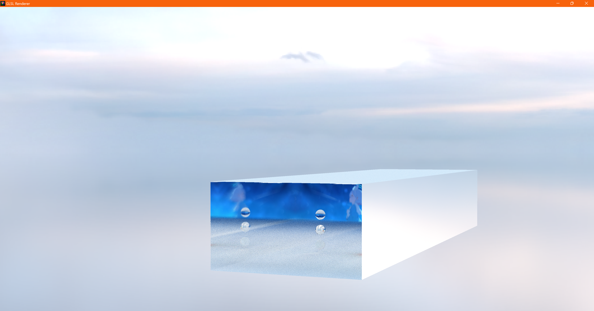
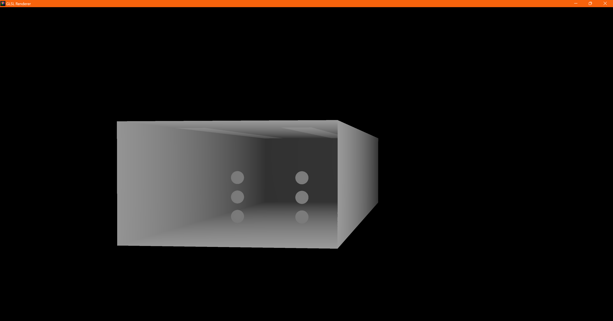

# Path Tracer

## Image and Demo:








## Controls:
```
W/S : Forwards/Backwards
A/D : Left/Right
E/Q : Up/Down

R   : Reread and Recompile Shader
V   : View Mode Cycle (Path-traced / ZDepth / Ambient Occlusion)
C   : Reset Camera Position
P   : Toggle Pause
ESC : Exit

Right-Click + Move : Look Around
Scroll-Wheel       : Increase Movement Sensitivity
```

## Dependencies
```
Visual Studio Community 2022   17.7.2
Windows 11 SDK                 10.0.22621.0
Windows 10 SDK                 10.0.20348.0
MSVC x64/x86                   v143

vcpkg : 
OpenGL                         4.6.0
GLFW                           3.3.8
stb_image.h
glad
```
